# Setting-up-a-virtual-home-lab
I built a free virtual IT lab from scratch on my home computer using open-source software.
 
In the early 2000s, setting up an IT lab required investing in physical servers or repurposing outdated computers. Although this approach offered valuable hands-on experience and skill development, it's now possible to create a virtualized IT lab at no cost, significantly streamlining the process. 

Let's dive in!

<h2>Index</h2>
<ul>                   
<li>Virtualization Overview</li>
<li>Free Virtualization Software</li>
<li>Downloading and Installing VirtualBox</li>
<li>Creating a Virtual Network</li>
<li>Creating a Virtual Machine</li>
<li>Downloading Your operating systems ISO(s)</li>
<li>Installing an OS on Your Lab VMs</li>
<li>Conclusion</li>
</ul>        

<h2>Virtualization Overview</h2>
Virtualization: What's behind the concept? In simple terms, virtualization is a technology that allows you to create a simulated computer environment. This is achieved through a Virtual Machine (VM), which enables you to run a complete computer system as a self-contained application on your existing computer.

 
On the image below - the top computer would be the host computer. The three computers below the host are referred to as guest virtual machines.
 
Virtual machines act like real computers, but run as a software program. So you can start, restart, shut down, install software and operating systems just like you would on a normal computer.
This makes virtual machines perfect for IT labs.

<h2>Free Virtualization Software</h2>
With so many different virtualization software options available, it can be pretty confusing to know which one is the "best" and which one you should use. Let's address this now.
 
There is no "best" virtualization software. There are simply different options - and the ones you should consider will depend on your host operating system.
 
In this setup I will be using Oracle VM VirtualBox because it is compatible with both Windows and Linux, but you can use any you want. The steps will nearly be identical to other virtualization software. 

 
<h2>Downloading and Installing VirtualBox</h2>
Download Oracle VM VirtualBox by clicking here. Once the download completes, I launched the installation.

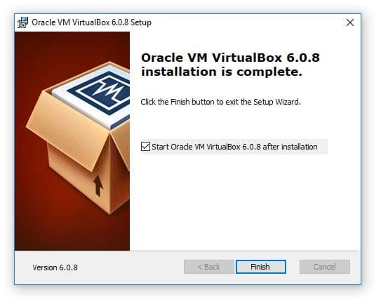

 
I Proceeded through the installation using all of the default options. Any prompts that are a yes/no you need to select "yes'.

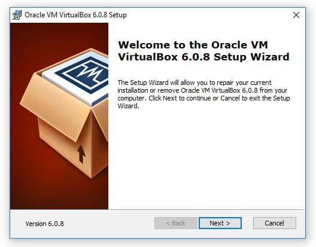
 
Click Finish and launch VirtualBox.

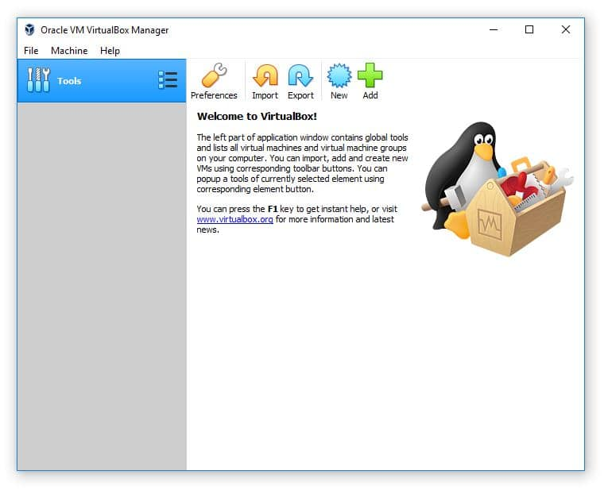
 
<h2>Creating a Virtual Machine</h2>
Now that we know what type of virtual network we want to use it's time to create a VM (Virtual Machine). We can do this by clicking the New button within the VirtualBox Manager.

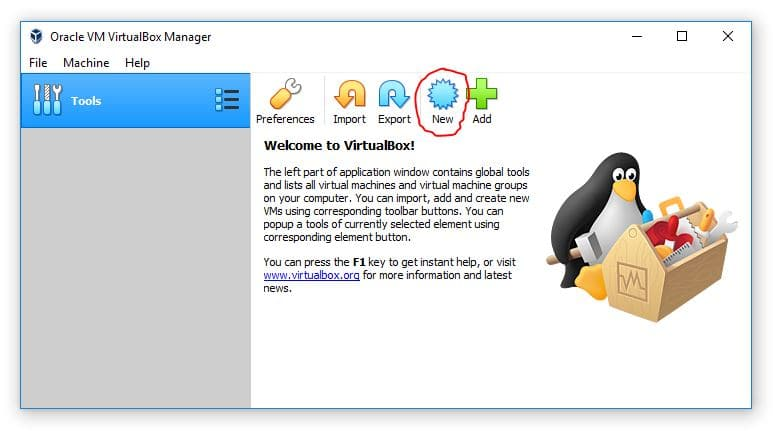
 
This will launch the new VM window. Go ahead and click the Expert Mode button. Don't worry - it doesn't make the process more difficult it only allows you to create a VM while navigating through less pages.

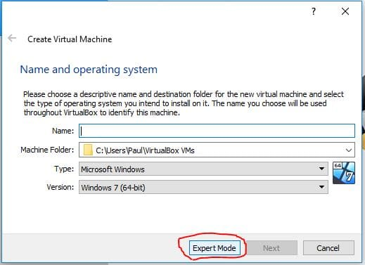
 
I am going to specify a name of "MyVM" and 2048 MB (2gb) of RAM then I will click Create.

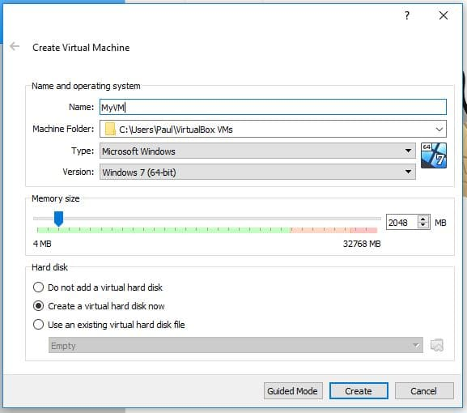
 
This will open another window for creating the Virtual Hard Disk. The default options here are all fine except for the File Size. I am going to set my new HDD to 60GB and then choose Create.

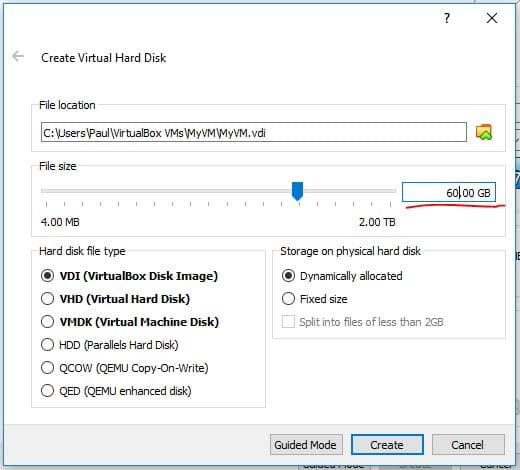

 
Since this HDD is going to be dynamically allocated (option on the middle-right of the screenshot below), the HDD file will only be as large as the amount of data stored on it - and a maximum of 60GB
Now you will see MyVM listed on the VirtualBox dashboard. Before we start the VM we can modify the settings of the VM if we want. Generally you might want to assign more processors, change the networking adapters and mount an ISO.

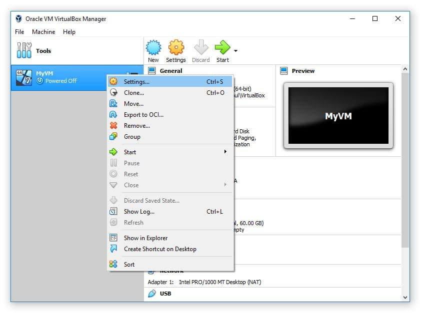

 
Increasing the processor CPUs can greatly improve the performance of your VM, so if at all possible increase the number of CPUs to 2.
Pro tip: Storing the VM's hard disk file on an SSD will also significantly increase the VMs performance.

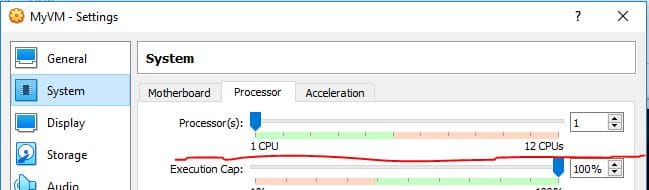
 
And that is all we need to do to create the VM. Of course we can't start the VM yet because we haven't downloaded or attached an operating system ISO... But we will cover that in the next section.

<h2>Creating a Virtual Network with VirtualBox</h2>
Virtual Networks allow you to connect your VMs to whatever you want. There are several different types of networks you can create with VirtualBox and the one you chose will depend on your requirements.
 
Keep in mind that you won't be able to access all of these network types if you haven't created a VM because some of them are configured from within the VM settings.
 
Here is an overview of the different network types you could create:

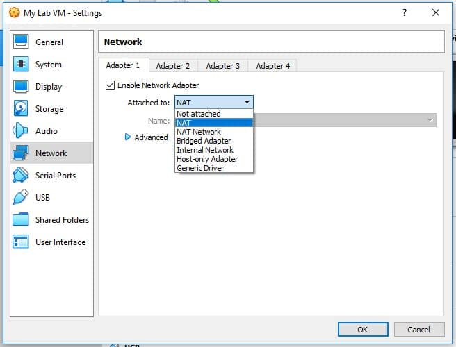
 

<h2>NAT</h2>
This network type allows your VMs to use the internet connectivity of the host computer. You will have no connectivity to other VMs or the host computer. Use this type if your lab will only have one VM.
 
Using NAT is as simple as right-clicking your VM and selecting Settings then navigating to the Network tab (image above)

<h2>NAT Network</h2>
This network is the same as NAT, but it allows your VMs to communicate to other VMs that are attached to the same NAT network. Use this when your labs use multiple VMs and need internet connectivity.
 
You can create a NAT Network by clicking on File > Preferences. Select the Network tab and then click the plus button to create a new NAT Network.

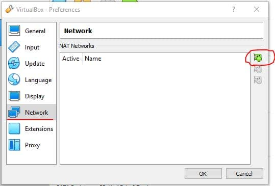
 

<h2>Bridged Adapter</h2>
Using this network type will cause your router to treat your VM as a physical computer. This means your VM will be connected to the same network as your host computer. Use this lab when you need to access your VMs from your host network.

Using a bridged adapter is as simple as right-clicking your VM and selecting Settings then navigating to the Network tab (image above)

<h2>Internal Network</h2>
This network provides your VMs with connectivity but no external access. Use this when you want to create an isolated IT lab.
Using an Internal Network is as simple as right-clicking your VM and selecting Settings then navigating to the Network tab (image above)

<h2>Host-only Adapter</h2>
This is essentially the same as an internal network, except that your host computer will have a direct IP connection to the VM. Meaning you can RDP, SSH or ping the VMs from the host computer. Use this network type when you will need direct access to the VMs from your host computer. It is commonly used for test web servers (think copying files from the host computer to the VM web server, or directly editing the code on the web server VM from your host computer.
 
You can create a host-only network by select File > Host Network Manager

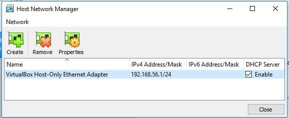
 

<h2>Generic Driver</h2>
Oracles documentation for the generic driver states:
The generic driver attachment is special and cannot be considered as an alternative to other attachment types.

I am going to use a NAT Network since this will allow me to connect my VMs to each other and the internet. 

First I will select File > Preferences, then navigate to the Network tab. Next I will click the plus button (circled in the image above).

This will create a new NAT Network. If I want to modify the subnet, disable DHCP or support IPv6 I can do this by double-clicking the NAT Network.

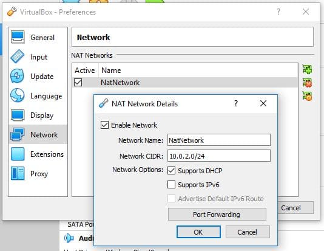
 

I am going to leave all of these options at default... so I am done creating the Virtual Network!
Configure the Networking tab for your chosen network type. Again, the easiest solution is to create and use a NAT Network.

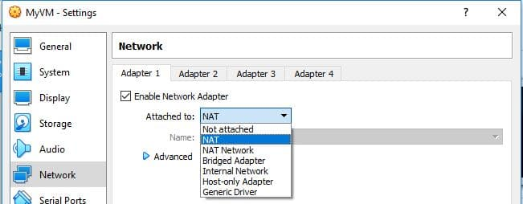
 

<h2>Downloading Your operating systems ISO(s)</h2>
Next we need an operating system (OS) to install on our Virtual Machines. You could do this with a physical disc if you wanted, but most of the time you will want to download an ISO for OS installations.
 
The easiest way to find what you're looking for is to simply google the name of your operating system with "ISO download" in the search.  For example if you want Windows Server 2016, just search 

"Windows Server 2016 ISO Download".
You should ONLY download ISOs from official websites. This means you shouldn't download Windows Server from a website like "sneakyfreecdkeys.com"...

I will still provide links to the most common operating systems that people want to install below. Keep in mind if the link is dead you can just run a quick google search and easily find the download.
Windows Server 2016
Windows 10 (requires a valid Windows 10 license to download)
Centos 7
Ubuntu
Kali Linux

<h2>Installing an OS on Your Lab VMs</h2>
Once you have downloaded your ISO file, it's time to mount it to your VM in VirtualBox. Mounting a VM is essentially like virtually inserting a disc into a DVD drive of a computer.
 
Right click on your VM and select settings then open the Storage tab. From there click the Empty disc icon, then again the disc icon under Attributes on the right hand side of the window. Click the Choose Virtual Optical Disk File... and browse to and open your desired ISO.

 

Click OK and now when we launch the VM you will be able to begin your OS installation.
I mounted a Windows Server 2016 ISO so when I launch the VM I will see the installation screen for this OS.

 
Now you can run through your OS installation and complete your lab setup.
Wrapping it Up...

That's it! Now you can  create some awesome IT labs and get more IT experience!

